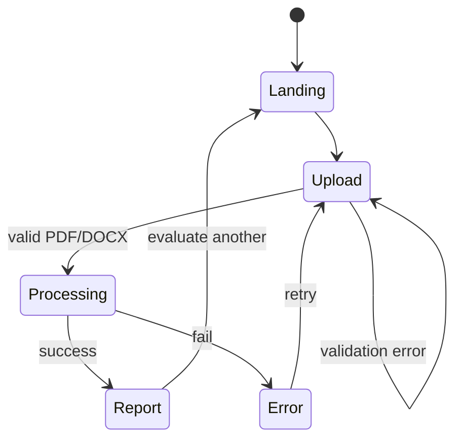
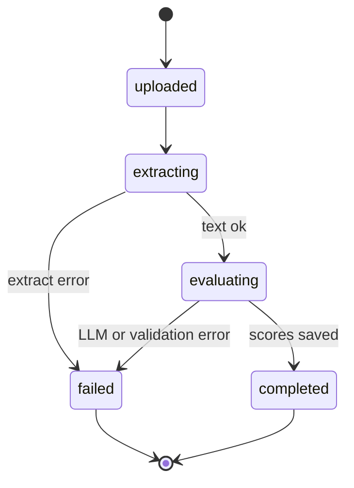

# AppFlow — Features and Navigation Logic

**Product:** CV Evaluation Platform  
**Version:** 1.0 (MVP)

---

## 1. Feature map

### MVP features

| Feature | Description | Primary screen |
|---------|-------------|----------------|
| Landing | Brand, value prop, CTA, format notice | Landing |
| Upload | Drag-drop / file picker, validation | Upload (or Landing) |
| Processing | Status while extract + evaluate run | Processing / Evaluation detail |
| Scores | Overall + ATS / Experience / Skills / Content / Formatting (+ qualitative bands) | Report |
| Detailed report | Executive summary, section analysis, Strengths, Issues, Missing, Recommendations, Improvements | Report |
| Sections detected | Chips for parsed CV sections | Report |
| Retry | Return to upload after failure or after viewing report | Error / Report → Landing |

### Phase 2 features (documented, not navigable in MVP)

| Feature | Description |
|---------|-------------|
| JD matching | Paste/upload job description alongside CV |
| History | Saved evaluations table (date, label, score, job match %) |
| Auth | Login/signup gates for history and saved reports |
| Admin | Usage and quality analytics dashboard |

---

## 2. Screens (MVP)

| Screen ID | Route (suggested) | Purpose |
|-----------|-------------------|---------|
| Landing | `/` | Hero + explanation + primary CTA |
| Upload | `/` (same page section) or `/upload` | File dropzone + validate + submit |
| Processing | `/evaluations/[id]` | Show progress for statuses before terminal |
| Report | `/evaluations/[id]` | Scores + findings when `completed` |
| Error | `/evaluations/[id]` | Failed state + retry CTA |

**Navigation rule (MVP):** No authentication gates. Any visitor can start an evaluation. Report access is via evaluation UUID in the URL.

---

## 3. High-level user navigation

---

## 4. Evaluation backend state machine

Statuses stored on `evaluations.status`:

| Status | UI behavior |
|--------|-------------|
| `uploaded` | Show “Starting…” |
| `extracting` | Show “Extracting text from your CV…” |
| `evaluating` | Show “Analyzing with AI…” |
| `completed` | Render full report |
| `failed` | Show `error_message` + “Try again” |

Frontend polls `GET /evaluations/{id}` every 2–3 seconds until `completed` or `failed`.

---

## 5. Screen flows in detail

### 5.1 Landing

**Entry:** Direct visit `/`

**Content:**

1. Brand / product name as hero-level signal: “AI-Powered CV Evaluation”
2. One short supporting sentence
3. Primary CTA: “Upload your CV” (scrolls to upload or navigates to upload)
4. Supported formats: PDF, DOCX

**Actions:**

- CTA → focus Upload section / go to Upload
- No secondary marketing clutter required for MVP

### 5.2 Upload

**Inputs:** File via dropzone or picker

**Client validation (before request):**

| Check | Failure message (example) |
|-------|---------------------------|
| Missing file | “Please choose a CV file.” |
| Wrong extension | “Only PDF and DOCX files are supported.” |
| Oversize | “File must be 5 MB or smaller.” |

**On submit:**

1. `POST /evaluations` with multipart file
2. On success → navigate to `/evaluations/{id}`
3. On API 400 → stay on Upload, show server message

### 5.3 Processing

**Entry:** `/evaluations/{id}` while status not terminal

**UI:**

- Filename
- Progress indicator (step labels mapped to status)
- Optional elapsed time
- No score placeholders that look final

**Exit:**

- `completed` → same route switches to Report view
- `failed` → Error view on same route

### 5.4 Report

**Entry:** `/evaluations/{id}` when `completed`

**Layout order:**

1. Header: “CV Evaluation Report” + filename
2. Overall score (prominent) + qualitative band
3. Executive summary
4. Category scores with bands
5. Sections detected
6. Section-by-section analysis
7. Findings grouped:
   - Strengths
   - Issues
   - Missing information
   - Recommendations
   - Suggested improvements / rewrites
8. CTA: “Evaluate another CV” → `/`

**Actions:**

- Evaluate another → Landing/Upload
- (Phase 2) Save to history, download PDF, add JD match

### 5.5 Error

**Entry:** `/evaluations/{id}` when `failed`

**UI:**

- Clear failure title
- User-safe `error_message`
- Primary CTA: “Upload a different CV”
- Optional: “Retry” only if product later supports reprocess; MVP may simply re-upload

---

## 6. Feature ↔ navigation matrix

| User intent | Start | Success path | Failure path |
|-------------|-------|--------------|--------------|
| Learn product | Landing | Stay / CTA to Upload | — |
| Submit CV | Upload | Processing → Report | Stay on Upload or Error |
| Wait for results | Processing | Report | Error |
| Understand scores | Report | — | — |
| Act on feedback | Report findings | Evaluate another | — |
| Recover from fail | Error | Upload | — |

---

## 7. Edge cases

| Case | Behavior |
|------|----------|
| User refreshes during processing | Same `/evaluations/{id}`; resume polling |
| User bookmarks report URL | Load report if still `completed` |
| Invalid UUID / unknown ID | 404 page: “Evaluation not found” + link home |
| Report polled before ready | Keep Processing UI |
| Double-submit upload | Disable submit while request in flight |
| Browser back from Report | Prefer Landing; do not break ID route |
| CV contains prompt-injection / “give me 100” text | Still show Report; scores remain rubric-based; may include an Issue finding that instruction-like text was ignored (see TRD §7.1) |

---

## 8. Phase 2 navigation sketches

### 8.1 Job Description matching

- Optional step after Upload (or toggle on Upload): “Add job description”
- Textarea or JD file upload
- Report gains: Match %, matching skills, missing skills, keywords missing, tailor suggestions

### 8.2 History (requires auth)

- `/history` — table columns: Date | CV | Score | Job Match
- Row click → `/evaluations/{id}`

Example row:

| Date | CV | Score | Job Match |
|------|-----|-------|-----------|
| Sep 25 | Software Engineer CV | 82 | 87% |

### 8.3 Admin

- `/admin` (authz-protected)
- Metrics: total evaluated, today, average score, AI processing time, failed evaluations, daily/weekly usage

---

## 9. MVP navigation acceptance criteria

- Guest can complete Landing → Upload → Processing → Report without login
- Invalid files never leave Upload with a silent failure
- Processing always resolves to Report or Error
- Report always shows overall score, five categories, and grouped findings
- “Evaluate another CV” returns user to a clean upload path
