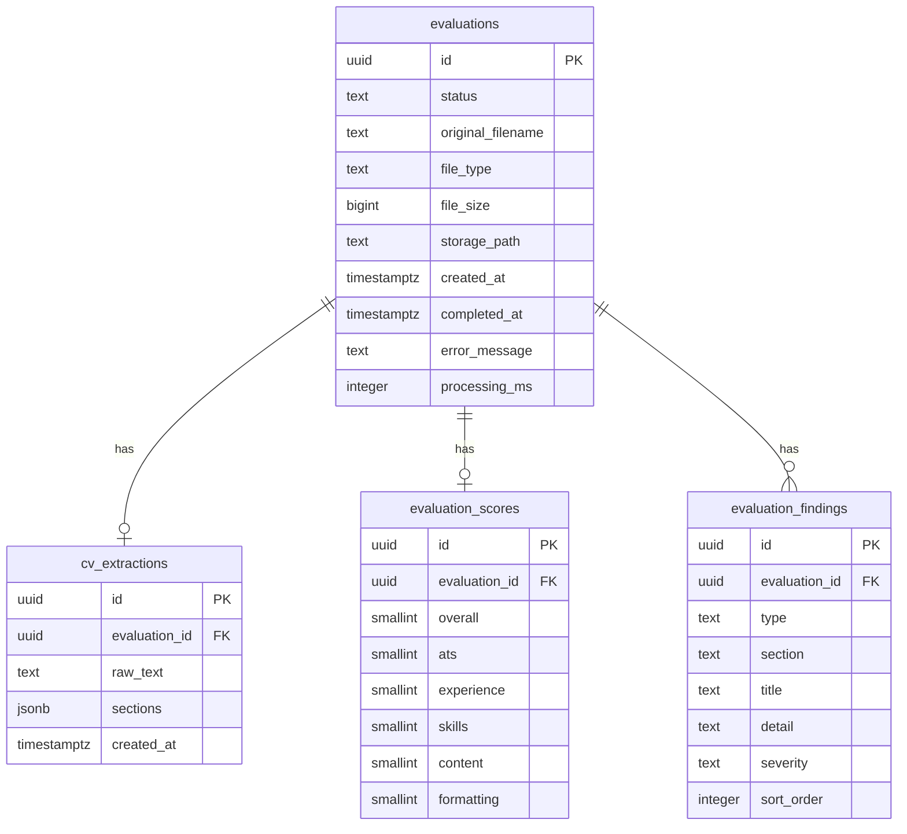

# Backend Schema

**Product:** CV Evaluation Platform  
**Database:** PostgreSQL on Neon  
**Version:** 1.0 (MVP)

Even without user auth in MVP, evaluations are persisted so reports can be retrieved by ID and so Phase 2 history/admin can build on the same tables.

---

## 1. Entity overview




---


## 2. Tables (MVP)


### 2.1 `evaluations`

Core lifecycle record for one uploaded CV.


| Column              | Type          | Constraints                     | Notes                                                             |
| ------------------- | ------------- | ------------------------------- | ----------------------------------------------------------------- |
| `id`                | `UUID`        | PK, default `gen_random_uuid()` | Public report key                                                 |
| `status`            | `TEXT`        | NOT NULL                        | `uploaded` | `extracting` | `evaluating` | `completed` | `failed` |
| `original_filename` | `TEXT`        | NOT NULL                        | User-facing name                                                  |
| `file_type`         | `TEXT`        | NOT NULL                        | `pdf` | `docx`                                                    |
| `file_size`         | `BIGINT`      | NOT NULL                        | Bytes                                                             |
| `storage_path`      | `TEXT`        | NOT NULL                        | Private server path or object key                                 |
| `created_at`        | `TIMESTAMPTZ` | NOT NULL, default `now()`       |                                                                   |
| `completed_at`      | `TIMESTAMPTZ` | NULL                            | Set on `completed` or `failed`                                    |
| `error_message`     | `TEXT`        | NULL                            | User-safe message when failed                                     |
| `processing_ms`     | `INTEGER`     | NULL                            | End-to-end processing duration                                    |


**Check (recommended):**

```sql
CHECK (status IN ('uploaded', 'extracting', 'evaluating', 'completed', 'failed'))
CHECK (file_type IN ('pdf', 'docx'))
```

**Indexes:**

```sql
CREATE INDEX idx_evaluations_status ON evaluations (status);
CREATE INDEX idx_evaluations_created_at ON evaluations (created_at DESC);
```

---


### 2.2 `cv_extractions`

One extraction payload per evaluation (1:1).


| Column          | Type          | Constraints                                                | Notes               |
| --------------- | ------------- | ---------------------------------------------------------- | ------------------- |
| `id`            | `UUID`        | PK                                                         |                     |
| `evaluation_id` | `UUID`        | NOT NULL, UNIQUE, FK → `evaluations(id)` ON DELETE CASCADE |                     |
| `raw_text`      | `TEXT`        | NOT NULL                                                   | Full extracted text |
| `sections`      | `JSONB`       | NOT NULL, default `{}`                                     | Structured sections |
| `created_at`    | `TIMESTAMPTZ` | NOT NULL, default `now()`                                  |                     |


**Index:**

```sql
CREATE UNIQUE INDEX idx_cv_extractions_evaluation_id ON cv_extractions (evaluation_id);
```

---


### 2.3 `evaluation_scores`

One score row per completed evaluation (1:1).


| Column          | Type       | Constraints                                                | Notes |
| --------------- | ---------- | ---------------------------------------------------------- | ----- |
| `id`            | `UUID`     | PK                                                         |       |
| `evaluation_id` | `UUID`     | NOT NULL, UNIQUE, FK → `evaluations(id)` ON DELETE CASCADE |       |
| `overall`       | `SMALLINT` | NOT NULL                                                   | 0–100 |
| `ats`           | `SMALLINT` | NOT NULL                                                   | 0–100 |
| `experience`    | `SMALLINT` | NOT NULL                                                   | 0–100 |
| `skills`        | `SMALLINT` | NOT NULL                                                   | 0–100 |
| `content`       | `SMALLINT` | NOT NULL                                                   | 0–100 |
| `formatting`    | `SMALLINT` | NOT NULL                                                   | 0–100 |


**Checks:** each score `BETWEEN 0 AND 100`.

**Index:** unique on `evaluation_id`.

---


### 2.4 `evaluation_findings`

Many findings per evaluation (1:N).


| Column          | Type      | Constraints                                        | Notes                                             |
| --------------- | --------- | -------------------------------------------------- | ------------------------------------------------- |
| `id`            | `UUID`    | PK                                                 |                                                   |
| `evaluation_id` | `UUID`    | NOT NULL, FK → `evaluations(id)` ON DELETE CASCADE |                                                   |
| `type`          | `TEXT`    | NOT NULL                                           | See enum below                                    |
| `section`       | `TEXT`    | NULL                                               | e.g. `experience`, `skills`, `summary`, `overall` |
| `title`         | `TEXT`    | NOT NULL                                           | Short headline                                    |
| `detail`        | `TEXT`    | NOT NULL                                           | Full explanation / suggestion                     |
| `severity`      | `TEXT`    | NULL                                               | `low` | `medium` | `high` (mainly for issues)     |
| `sort_order`    | `INTEGER` | NOT NULL, default `0`                              | Display order within type                         |


**Type values:**

`strength` | `issue` | `missing` | `recommendation` | `improvement`

```sql
CHECK (type IN ('strength', 'issue', 'missing', 'recommendation', 'improvement'))
```

**Indexes:**

```sql
CREATE INDEX idx_evaluation_findings_evaluation_id ON evaluation_findings (evaluation_id);
CREATE INDEX idx_evaluation_findings_type ON evaluation_findings (evaluation_id, type);
```

---


## 3. `sections` JSON shape

Stored in `cv_extractions.sections`:

```json
{
  "personal_information": {
    "name": "Jane Doe",
    "email": "jane@example.com",
    "phone": "+1...",
    "location": "City, Country",
    "links": ["https://linkedin.com/in/..."]
  },
  "summary": "Product-minded software engineer...",
  "skills": ["Python", "React", "PostgreSQL"],
  "experience": [
    {
      "title": "Software Engineer",
      "company": "Acme",
      "start": "2022-01",
      "end": "Present",
      "bullets": ["Built ...", "Improved ..."]
    }
  ],
  "education": [
    {
      "degree": "B.S. Computer Science",
      "institution": "State University",
      "year": "2021"
    }
  ],
  "projects": [
    {
      "name": "CV Toolkit",
      "description": "...",
      "bullets": ["..."]
    }
  ],
  "certifications": [
    {
      "name": "AWS Cloud Practitioner",
      "issuer": "Amazon",
      "year": "2024"
    }
  ]
}
```

Missing sections may be `null`, `[]`, or omitted; extraction should still succeed with best-effort parsing.

---


## 4. Report API payload (derived)

`GET /evaluations/{id}/report` aggregates:

```json
{
  "id": "3fa85f64-5717-4562-b3fc-2c963f66afa6",
  "status": "completed",
  "original_filename": "Software_Engineer_CV.pdf",
  "created_at": "2026-09-25T10:00:00Z",
  "completed_at": "2026-09-25T10:00:18Z",
  "processing_ms": 18420,
  "scores": {
    "overall": 78,
    "ats": 82,
    "experience": 75,
    "skills": 80,
    "content": 72,
    "formatting": 85
  },
  "findings": [
    {
      "type": "strength",
      "section": "skills",
      "title": "Clear technical skill list",
      "detail": "Skills are specific and easy for ATS systems to parse.",
      "severity": null
    },
    {
      "type": "issue",
      "section": "experience",
      "title": "Missing measurable results",
      "detail": "Your experience bullets don't clearly mention measurable results.",
      "severity": "medium"
    },
    {
      "type": "missing",
      "section": "summary",
      "title": "No professional summary",
      "detail": "A short summary helps recruiters quickly understand your focus.",
      "severity": "low"
    },
    {
      "type": "recommendation",
      "section": "experience",
      "title": "Quantify impact",
      "detail": "Rewrite bullets to include metrics where possible.",
      "severity": null
    },
    {
      "type": "improvement",
      "section": "experience",
      "title": "Suggested bullet",
      "detail": "Add measurable outcomes such as revenue generated, performance improvement, users served, etc.",
      "severity": null
    }
  ],
  "sections_detected": ["personal_information", "skills", "experience", "education"]
}
```

`sections_detected` can be computed from non-empty keys in `cv_extractions.sections`.

---


## 5. Example DDL (MVP)

```sql
CREATE EXTENSION IF NOT EXISTS pgcrypto;

CREATE TABLE evaluations (
  id UUID PRIMARY KEY DEFAULT gen_random_uuid(),
  status TEXT NOT NULL CHECK (status IN ('uploaded', 'extracting', 'evaluating', 'completed', 'failed')),
  original_filename TEXT NOT NULL,
  file_type TEXT NOT NULL CHECK (file_type IN ('pdf', 'docx')),
  file_size BIGINT NOT NULL CHECK (file_size > 0),
  storage_path TEXT NOT NULL,
  created_at TIMESTAMPTZ NOT NULL DEFAULT now(),
  completed_at TIMESTAMPTZ,
  error_message TEXT,
  processing_ms INTEGER
);

CREATE TABLE cv_extractions (
  id UUID PRIMARY KEY DEFAULT gen_random_uuid(),
  evaluation_id UUID NOT NULL UNIQUE REFERENCES evaluations(id) ON DELETE CASCADE,
  raw_text TEXT NOT NULL,
  sections JSONB NOT NULL DEFAULT '{}'::jsonb,
  created_at TIMESTAMPTZ NOT NULL DEFAULT now()
);

CREATE TABLE evaluation_scores (
  id UUID PRIMARY KEY DEFAULT gen_random_uuid(),
  evaluation_id UUID NOT NULL UNIQUE REFERENCES evaluations(id) ON DELETE CASCADE,
  overall SMALLINT NOT NULL CHECK (overall BETWEEN 0 AND 100),
  ats SMALLINT NOT NULL CHECK (ats BETWEEN 0 AND 100),
  experience SMALLINT NOT NULL CHECK (experience BETWEEN 0 AND 100),
  skills SMALLINT NOT NULL CHECK (skills BETWEEN 0 AND 100),
  content SMALLINT NOT NULL CHECK (content BETWEEN 0 AND 100),
  formatting SMALLINT NOT NULL CHECK (formatting BETWEEN 0 AND 100)
);

CREATE TABLE evaluation_findings (
  id UUID PRIMARY KEY DEFAULT gen_random_uuid(),
  evaluation_id UUID NOT NULL REFERENCES evaluations(id) ON DELETE CASCADE,
  type TEXT NOT NULL CHECK (type IN ('strength', 'issue', 'missing', 'recommendation', 'improvement')),
  section TEXT,
  title TEXT NOT NULL,
  detail TEXT NOT NULL,
  severity TEXT CHECK (severity IS NULL OR severity IN ('low', 'medium', 'high')),
  sort_order INTEGER NOT NULL DEFAULT 0
);

CREATE INDEX idx_evaluations_status ON evaluations (status);
CREATE INDEX idx_evaluations_created_at ON evaluations (created_at DESC);
CREATE INDEX idx_evaluation_findings_evaluation_id ON evaluation_findings (evaluation_id);
CREATE INDEX idx_evaluation_findings_type ON evaluation_findings (evaluation_id, type);
```

Use a migration tool (e.g. Alembic) in the FastAPI project.

---


## 6. Phase 2 schema sketches

Not implemented in MVP; reserved for later migrations.

### 6.1 `users`


| Column          | Type                 | Notes            |
| --------------- | -------------------- | ---------------- |
| `id`            | UUID PK              |                  |
| `email`         | TEXT UNIQUE NOT NULL |                  |
| `password_hash` | TEXT NULL            | If password auth |
| `created_at`    | TIMESTAMPTZ          |                  |


Add nullable `user_id UUID REFERENCES users(id)` on `evaluations`.

### 6.2 `job_matches`


| Column                 | Type           | Notes |
| ---------------------- | -------------- | ----- |
| `id`                   | UUID PK        |       |
| `evaluation_id`        | UUID FK UNIQUE |       |
| `job_description_text` | TEXT           |       |
| `match_percentage`     | SMALLINT       | 0–100 |
| `matching_skills`      | JSONB          |       |
| `missing_skills`       | JSONB          |       |
| `missing_keywords`     | JSONB          |       |
| `relevant_experience`  | JSONB          |       |
| `suggestions`          | JSONB          |       |


### 6.3 Admin metrics

Prefer **queries over** `evaluations` rather than a separate `admin_metrics` table for MVP→Phase 2:

- Total CVs: `COUNT(*)`
- Today: `WHERE created_at::date = CURRENT_DATE`
- Average score: `AVG(evaluation_scores.overall)` for completed
- AI processing time: `AVG(processing_ms)`
- Failed: `WHERE status = 'failed'`
- Daily/weekly usage: `date_trunc` group by

Optional materialized views later if volume grows.

---


## 7. Data lifecycle notes


| Topic           | MVP approach                                                                       |
| --------------- | ---------------------------------------------------------------------------------- |
| File retention  | Keep `storage_path` at least until evaluation completes; delete or GC policy later |
| Cascade deletes | Deleting `evaluations` removes extraction, scores, findings                        |
| PII             | CVs contain PII — restrict DB access; no public buckets                            |
| Idempotency     | One extraction and one scores row per evaluation                                   |


---


## 8. Schema acceptance criteria

- [ ] Can create evaluation and transition statuses
- [ ] Can store raw text + sections JSON
- [ ] Can store five category scores + overall with 0–100 checks
- [ ] Can store multiple typed findings ordered for display
- [ ] Report query joins complete for a `completed` evaluation